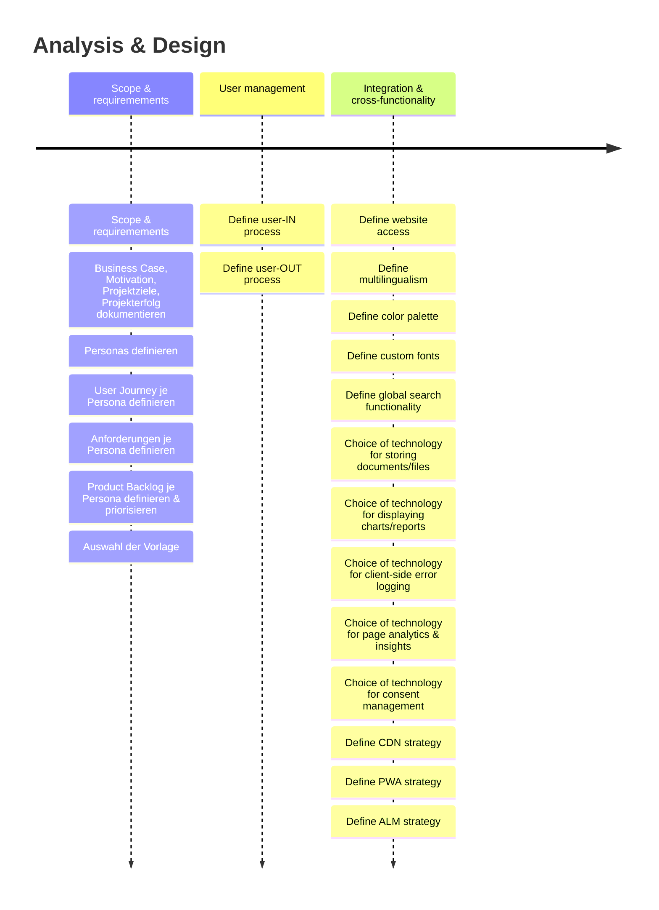

```mermaid
timeline
title Analysis & Design
    Scope & requiremements : Scope & requiremements : Business Case, Motivation, Projektziele, Projekterfolg dokumentieren: Personas definieren: User Journey je Persona definieren: Anforderungen je Persona definieren: Product Backlog je Persona definieren & priorisieren: Auswahl der Vorlage
    User management : Define user-IN process : Define user-OUT process
    Integration & cross-functionality : Define website access : Define multilingualism : Define color palette : Define custom fonts : Define global search functionality : Choice of technology for storing documents/files : Choice of technology for displaying charts/reports : Choice of technology for client-side error logging : Choice of technology for page analytics & insights : Choice of technology for consent management : Define CDN strategy : Define PWA strategy : Define ALM strategy
```