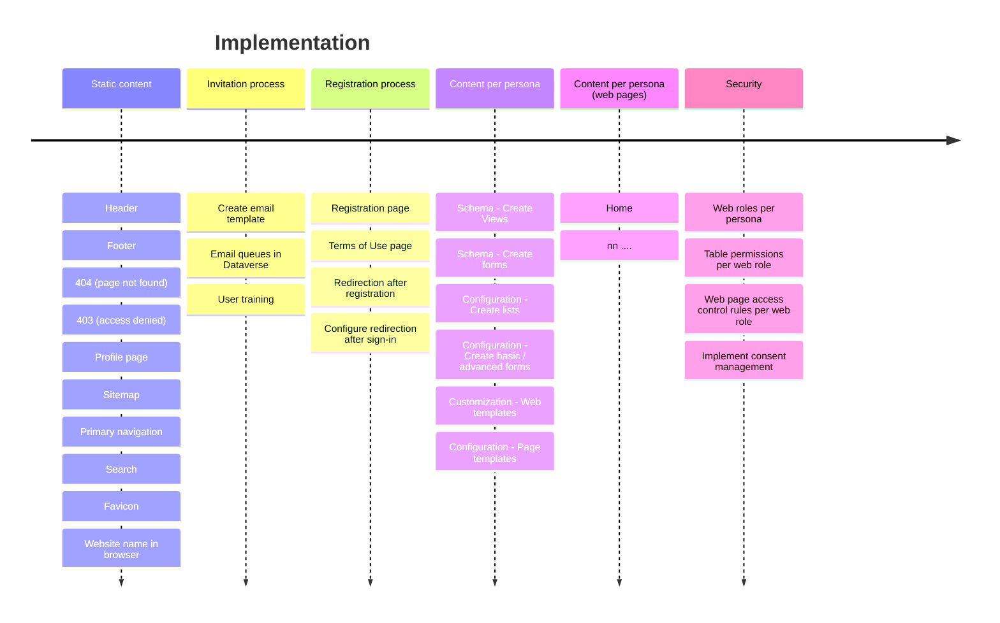

```mermaid
timeline
title Implementation
    Static content : Header : Footer : 404 (page not found) : 403 (access denied) : Profile page : Sitemap : Primary navigation : Search : Favicon : Website name in browser
    Invitation process : Create email template : Email queues in Dataverse : User training
    Registration process : Registration page : Terms of Use page : Redirection after registration : Configure redirection after sign-in
    Content per persona : Schema - Create Views : Schema - Create forms : Configuration - Create lists : Configuration - Create basic / advanced forms : Customization - Web templates : Configuration - Page templates
    Content per persona (web pages) : Home : nn ....
    Security : Web roles per persona : Table permissions per web role : Web page access control rules per web role : Implement consent management    
```