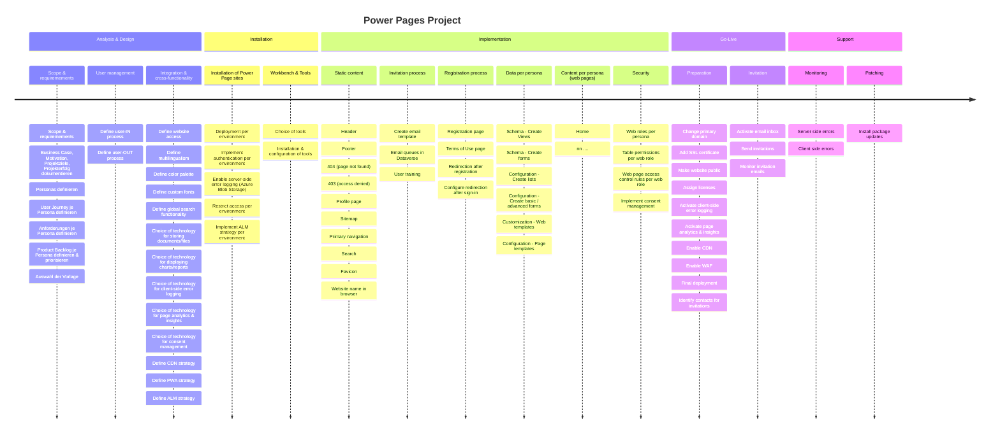

Business Case

```mermaid
timeline
title Power Pages Project
section Analysis & Design
    Scope & requiremements : Scope & requiremements : Business Case, Motivation, Projektziele, Projekterfolg dokumentieren: Personas definieren: User Journey je Persona definieren: Anforderungen je Persona definieren: Product Backlog je Persona definieren & priorisieren: Auswahl der Vorlage
    User management : Define user-IN process : Define user-OUT process
    Integration & cross-functionality : Define website access : Define multilingualism : Define color palette : Define custom fonts : Define global search functionality : Choice of technology for storing documents/files : Choice of technology for displaying charts/reports : Choice of technology for client-side error logging : Choice of technology for page analytics & insights : Choice of technology for consent management : Define CDN strategy : Define PWA strategy : Define ALM strategy
section Installation
    Installation of Power Page sites : Deployment per environment : Implement authentication per environment : Enable server-side error logging (Azure Blob Storage) : Restrict access per environment : Implement ALM strategy per environment
    Workbench & Tools : Choice of tools : Installation & configuration of tools
section Implementation
    Static content : Header : Footer : 404 (page not found) : 403 (access denied) : Profile page : Sitemap : Primary navigation : Search : Favicon : Website name in browser
    Invitation process : Create email template : Email queues in Dataverse : User training
    Registration process : Registration page : Terms of Use page : Redirection after registration : Configure redirection after sign-in
    Data per persona : Schema - Create Views : Schema - Create forms : Configuration - Create lists : Configuration - Create basic / advanced forms : Customization - Web templates : Configuration - Page templates
    Content per persona (web pages) : Home : nn ....
    Security : Web roles per persona : Table permissions per web role : Web page access control rules per web role : Implement consent management    
section Go-Live
    Preparation : Change primary domain : Add SSL certificate : Make website public: Assign licenses : Activate client-side error logging : Activate page analytics & insights : Enable CDN : Enable WAF : Final deployment : Identify contacts for invitations
    Invitation : Activate email inbox : Send invitations : Monitor invitation emails
section Support
    Monitoring : Server side errors : Client side errors
    Patching : Install package updates
```